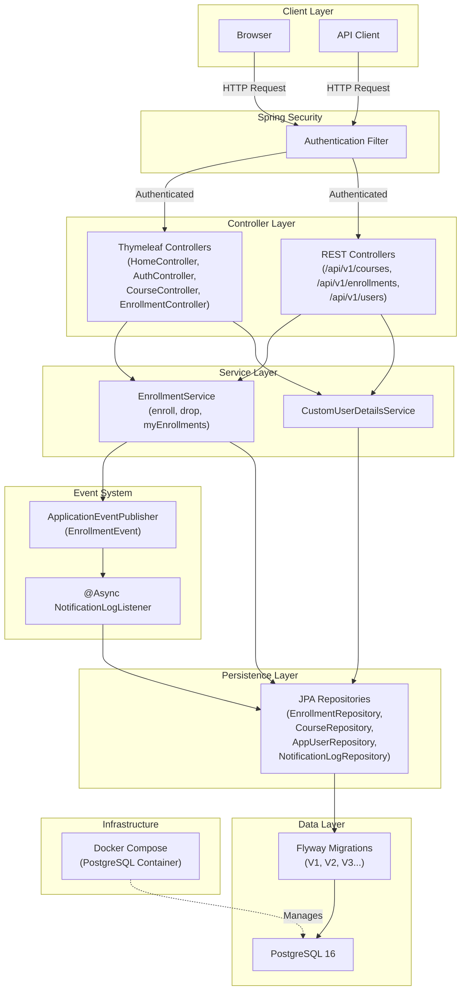

# UniPortal – University Course Management Portal

##  Key Highlights

-  **Production-aware architecture** — PostgreSQL, Docker Compose, Flyway versioned migrations, Spring profiles (dev/prod)
-  **Role-based security** — Spring Security with BCrypt, separate ADMIN and STUDENT access controls across UI and API
-  **Async event-driven design** — enrollment actions publish domain events via ApplicationEventPublisher, persisted asynchronously via @Async listener
-  **Dual interface** — server-rendered Thymeleaf UI + documented REST API (/api/v1/) with OpenAPI 3.0 / Swagger UI
-  **Automated test suite** — 14 passing tests covering unit, integration, and DB smoke layers
-  **Polished UI** — toast notifications, modal confirmations, role-aware navigation, responsive card layouts

### [Purpose](#1-purpose)
### [Tech Stack](#2-tech-stack)
### [System Requirements](#3-system-requirements)
### [Installation Guide](#4-installation-guide)
### [Features and Project Walkthrough](#5-features-and-project-walkthrough)
### [Architecture Diagram](#6-architecture-diagram)
### [Design Decisions](#7-design-decisions)
### [API Reference](#8-api-reference)
### [Test Suite](#9-test-suite)

## 1. Purpose

UniPortal is a university course management application built to handle authentication, course administration, and student enrollment workflows in a single Spring Boot system. At a high level, the stack combines Spring Boot, Thymeleaf, PostgreSQL, Flyway, Spring Security, and Docker-based local infrastructure for reproducible development. The codebase has evolved from a prototype-style implementation into a production-aware structure with stronger testing, environment separation, and API-first support. It intentionally supports a dual interface model: server-rendered Thymeleaf pages for web users and `/api/v1/**` REST endpoints for programmatic access. Enrollment and drop actions are wired through async event publishing so notification/audit logging can happen without blocking core user actions. Database schema and seed lifecycle are managed through Flyway migrations, while Docker Compose provides predictable PostgreSQL provisioning.

### What users can do

- **Admin**
  - View dashboard statistics (total students, courses, enrollments)
  - Add and delete courses
  - View enrollment counts per course
  - Drop all enrollments for a selected course
- **Student**
  - Register and log in
  - Browse courses in card view
  - Enroll in available courses
  - Drop enrolled courses
  - View personal enrollments in "My Enrolled Courses"

## 2. Tech Stack

| Layer | Technology |
|-------|------------|
| Backend | Spring Boot 3.3.2, Java 17 |
| Frontend | Thymeleaf, HTML/CSS, Vanilla JS |
| Database | PostgreSQL 16 (Docker) |
| Migrations | Flyway |
| Security | Spring Security, BCrypt |
| API Docs | springdoc-openapi (OpenAPI 3.0) |
| Testing | JUnit 5, Mockito, Spring MockMvc, TestNG, Selenium |
| Build | Maven |
| Infrastructure | Docker Compose |
| Events | Spring ApplicationEventPublisher (@Async) |

## 3. System Requirements

- Java **17+**
- Maven **3.8+**
- Docker Desktop
- Git

### Verification commands

```bash
java -version
mvn -version
docker --version
docker compose version
git --version
```

## 4. Installation Guide

### Step 1: Clone the repository

```bash
git clone <your-repo-url>
cd UniPortal
```

### Step 2: Start PostgreSQL with Docker Compose

```bash
docker compose up -d
docker compose ps
```

### Step 3: Run the application

```bash
mvn spring-boot:run
```

### Default credentials

| Username | Password | Role |
|---|---|---|
| `admin1` | `Admin@123` | `ADMIN` |
| `student1` | `Student@123` | `STUDENT` |

### Port conflict note (PostgreSQL on 5432)

If you already run local PostgreSQL on port 5432, stop it before starting Docker Compose:

```bash
brew services stop postgresql@16
```

## 5. Features and Project Walkthrough

<!-- SCREENSHOT: Landing page hero -->
*Home page — visit http://localhost:8080 to access UniPortal. Click Login to sign in or Register to create a new student account.*


<!-- SCREENSHOT: Login page -->
*Login page — enter your credentials to access the portal. Default credentials are listed in the Installation Guide.*


*Register page — create a new student account with username and password. 
Real-time client-side validation ensures passwords match before submission.*


### Admin Features

- Dashboard with admin stat cards (students, courses, enrollments)
- Course search and management page with admin actions
- Add new course form with validation
- Delete course action (with dependency-safe behavior)
- Drop-all-enrollments action per course

<!-- SCREENSHOT: Admin dashboard with stat cards -->
*Admin dashboard — shows real-time statistics including total students, courses, and enrollments across the platform.*


<!-- SCREENSHOT: Admin courses table with enrollment counts -->
*Admin course management — view enrollment counts per course, add new courses, drop all enrollments for a course, or delete courses.*


### Student Features

- Register and sign in
- Browse courses in card layout
- Enroll/drop course actions
- "My Enrolled Courses" page with enrollment timestamps
- Toast notifications for success/warning/error feedback


<!-- SCREENSHOT: Student course cards view -->
*Student course browser — browse all available courses as cards. Click Enroll to join a course or Drop to leave one.*


<!-- SCREENSHOT: My Enrolled Courses page -->
*My Enrolled Courses — view all courses you are currently enrolled in along with enrollment timestamps.*

### API Documentation

- OpenAPI/Swagger UI is available for API exploration.

<!-- SCREENSHOT: Swagger UI -->


## 6. Architecture Diagram



## 7. Design Decisions

- **Flyway over `ddl-auto=update`**: Flyway gives explicit, versioned migration files that can be reviewed, tested, and deployed in a controlled order. This avoids implicit runtime schema mutations that are difficult to audit and can behave differently across environments. It also makes onboarding and CI more predictable because schema creation and seed data are reproducible from source-controlled SQL. For a course platform with evolving entities like users, courses, and enrollments, that traceability is a long-term stability advantage.
- **Async events for audit logging**: Enrollment operations publish domain events through `ApplicationEventPublisher`, which cleanly separates core business actions from side effects. `NotificationLogListener` handles audit persistence with `@Async`, so enrollment/drop flows stay responsive and do not block on logging latency. This pattern improves maintainability because logging concerns can evolve without tightly coupling to service methods. It also creates a clear extension point for future notifications (email, webhooks, analytics) without rewriting enrollment logic.
- **Spring profiles (`dev`/`prod`)**: Profile-based configuration isolates local-development behavior from production-oriented behavior in a clear, standard Spring mechanism. The `dev` profile supports local iteration with H2-oriented settings, while `prod` aligns with PostgreSQL and Flyway migration execution. This separation reduces accidental misconfiguration and makes environment intent explicit at startup. It also keeps sensitive or environment-specific settings out of hard-coded application logic.
- **Thymeleaf UI + REST API together**: The project serves both browser users and API consumers from one application so business logic can be centralized and reused. Thymeleaf provides fast, server-rendered UX for the portal experience, while REST endpoints under `/api/v1/**` support integration and programmatic access. Keeping both layers together reduces duplication in models, repositories, and security policies. It also allows incremental evolution toward API-driven clients without abandoning the existing web interface.
- **BCrypt + Spring Security**: BCrypt ensures passwords are stored as strong one-way hashes instead of reversible or plain-text values. Spring Security provides standardized authentication, route authorization, and role-based access control with minimal custom security plumbing. Together they reduce security risk by relying on mature, well-tested framework behavior rather than ad hoc implementations. This is especially important for a role-sensitive system where ADMIN and STUDENT permissions must remain consistently enforced across UI and API paths.

## 8. API Reference

Swagger UI: `http://localhost:8080/swagger-ui/index.html`

| Method | Path | Access Level | Description |
|---|---|---|---|
| `GET` | `/api/v1/courses` | Authenticated user | Return all courses |
| `GET` | `/api/v1/courses/{id}` | Authenticated user | Return one course by id (`404` if missing) |
| `POST` | `/api/v1/courses` | Authenticated + ADMIN check | Create a course (`403` for non-admin) |
| `DELETE` | `/api/v1/courses/{id}` | Authenticated + ADMIN check | Delete a course (`403` for non-admin, `404` if missing) |
| `POST` | `/api/v1/enrollments/enroll?courseId={id}` | Authenticated user | Enroll current user in course (`201`, `404`, `409`) |
| `DELETE` | `/api/v1/enrollments/drop/{courseId}` | Authenticated user | Drop current user's enrollment (`200`/`404`) |
| `GET` | `/api/v1/enrollments/my-courses` | Authenticated user | Return current user's enrollments |
| `GET` | `/api/v1/users/me` | Authenticated user | Return current user profile (without password hash) |

*Swagger UI — interactive REST API documentation at http://localhost:8080/swagger-ui/index.html. 
The GET /api/v1/courses endpoint returns all courses with their IDs, 
which can then be used in other endpoints like GET /api/v1/courses/{id} 
or DELETE /api/v1/enrollments/drop/{courseId}.*


> **Note:** All `/api/v1/**` endpoints require authentication. To test via Swagger UI, log in at `http://localhost:8080/login` first in the same browser session, then return to Swagger UI and execute requests.

> **Tip:** To find valid IDs for path parameters, first call `GET /api/v1/courses` or `GET /api/v1/users/me` to retrieve existing resource IDs. Use those IDs in endpoints like `GET /api/v1/courses/{id}` or `DELETE /api/v1/enrollments/drop/{courseId}`.

## 9. Test Suite

### Test categories

- **Unit tests**
  - `EnrollmentServiceTest` (**5 tests**) - service-layer enrollment/drop logic and exception paths
  - `RegisterRequestValidationTest` (**5 tests**) - DTO + custom password constraint validation
- **Integration tests**
  - `CourseApiControllerTest` (**4 tests**) - authenticated/unauthenticated API behavior and role restrictions
- **DB smoke test**
  - `DBSmokeTest` - sanity checks for seeded DB records and basic query path

### Run tests

Run the full suite:

```bash
mvn clean test
```

Run one specific test class:

```bash
mvn -Dtest=ClassName test
```

Test reports are generated in:

- `target/surefire-reports/`

Current status:
*Test suite results — 14 tests passing across unit, integration, 
and DB smoke test layers. Run with: mvn clean test*


- **14 tests, 0 failures**
